# 🏦 C++ Bank System

A fully functional, file-based banking system built in C++. It supports user authentication, permission-based access (Admin and User), and core banking operations like deposit, withdrawal, transfer, and transaction tracking.

---

## 🚀 Features

- 🔐 **Login System**
  - Separate roles: `Admin` and `User`

- 💳 **Banking Operations**
  - Deposit, Withdraw, and Transfer
  - Transaction validation and balance checking

- 🔑 **Admin Controls**
  - View all users
  - Reset passwords
  - Delete or create accounts

- 🗃️ **Data Handling**
  - All data is stored using plain text files

---

## 🛠️ Technologies Used

- **Language**: C++
- **Data Storage**: File Handling (`.txt` files)

---
## 🌳 System Structure
                            Login----------------------------------------------------------------------------------------<
                              |                                                                                          |
                          Main Menu                                                                                      |
         -----------------------------------------------------------------------------------------------------------     |
         |         |        |          |        |            |                                   |                 |     |
    Show C List  AddC    DeleteC   UpdateC    FindC    Transaction Menu                     Manage Users        Logout---^
                                                       /     |       \                           |
                                               Deposit    Withdraw   Total Balances              |-List Users
                                                                                                 |-Add User
                                                                                                 |-Delete User
                                                                                                 |-Update User
                                                                                                 |-Find User
   

    *) C = Client

---

## 📷 Screenshots

  
📸 Click to view screenshots

  ### 🔐 Login Page  
  

  ---

  ### 🏠 Main Menu  
  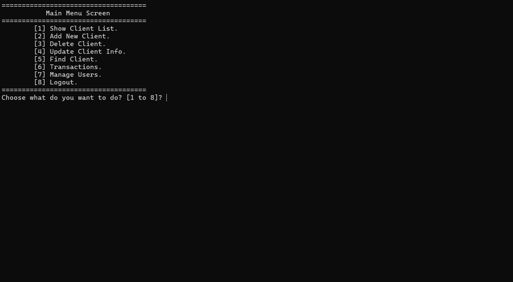

  #### ➕ Add New Client  
  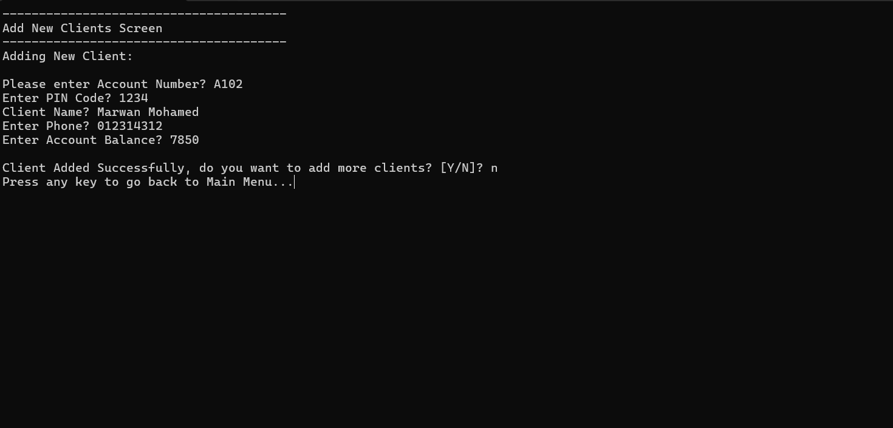

  #### 🔍 Find Client  
  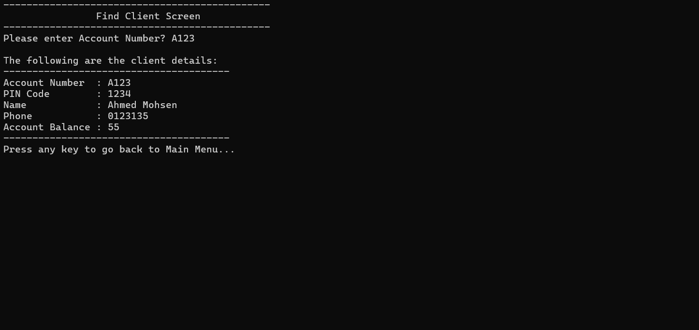

  #### ✏️ Update Client  
  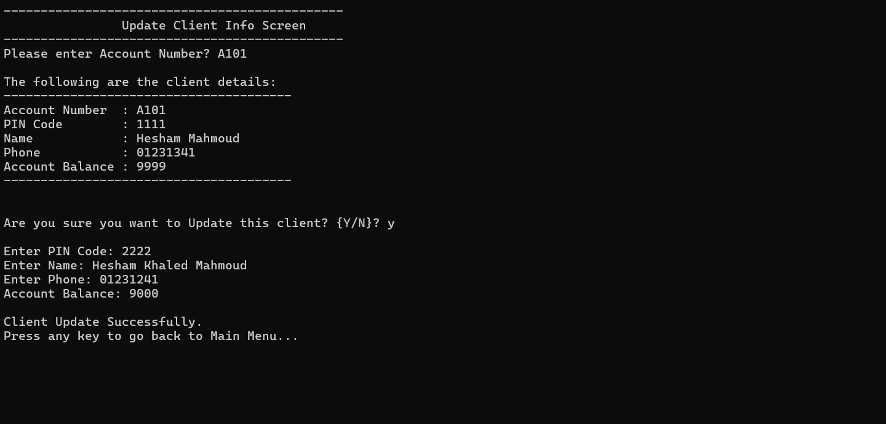

  #### 🗑️ Delete Client  
  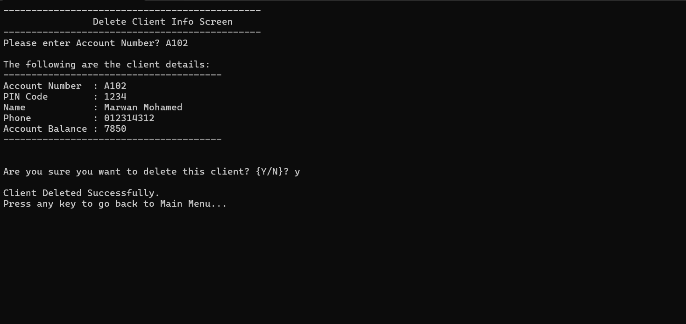

  #### 📋 List All Clients  
  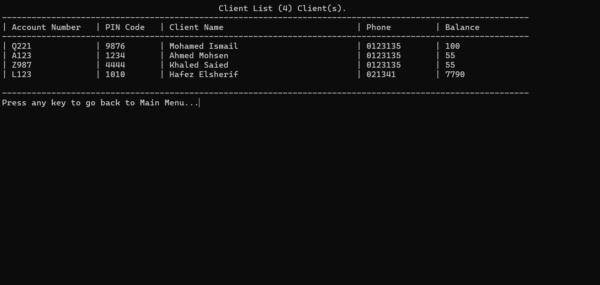

---

  ### 🧾 Transaction Menu  
  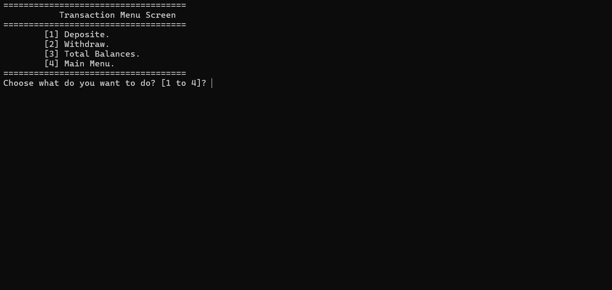

  ### 💰 Deposit Page  
  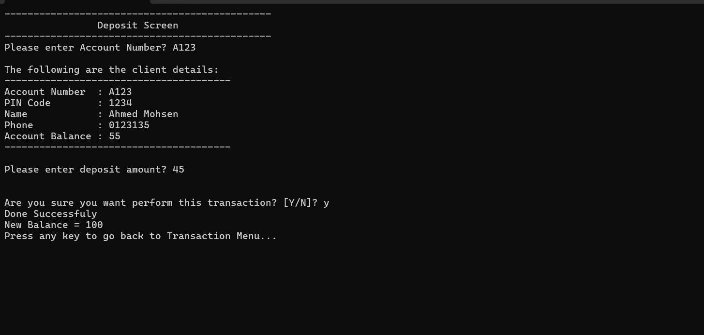

  ### 💸 Withdraw Page  
  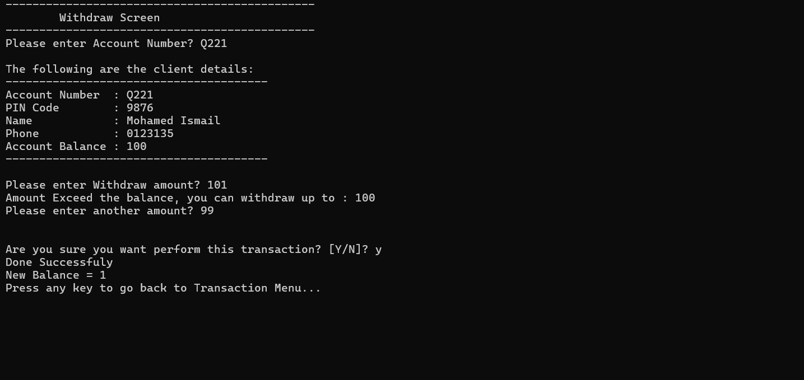

  ### ⚖️ Total Balances  
  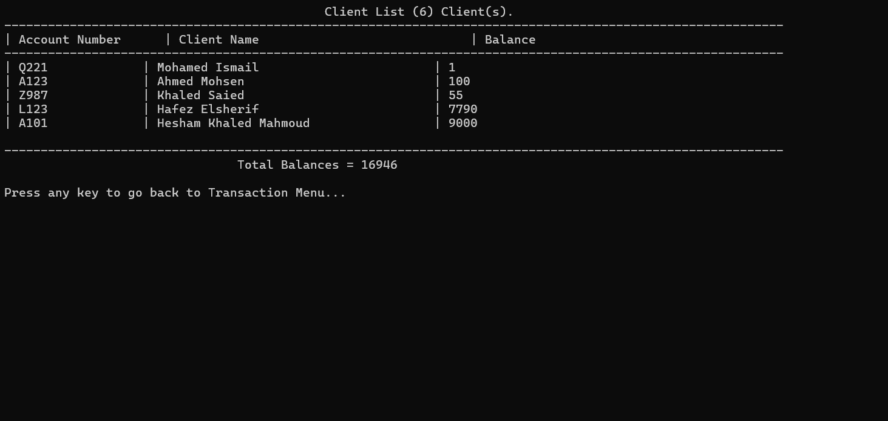

---

  ### 🛠️ Manage Users Menu  
  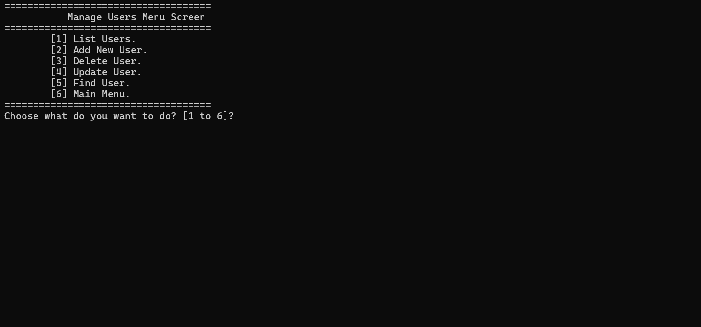

  #### ➕ Add New User  
  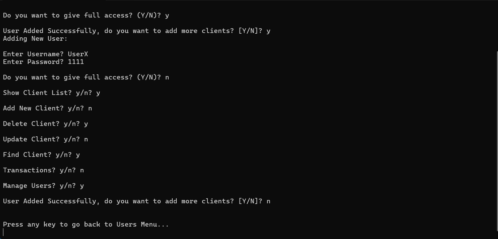

  #### ✏️ Update User  
  

  #### 📋 List All Users  
  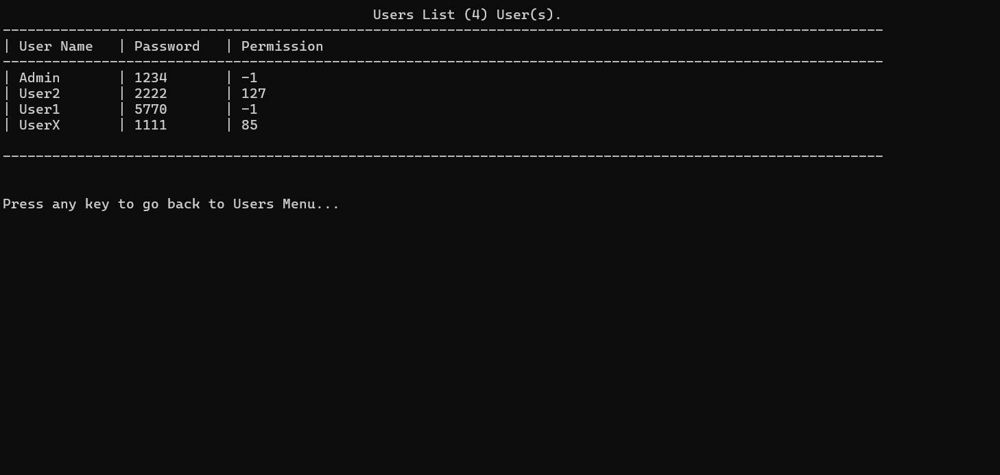

                          
